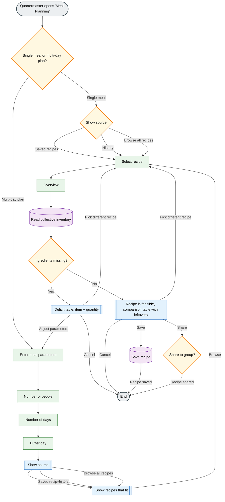

# Artifact 2 - Deciding

---

## Recipe-Based deficit calculation

This capability allows the Fellowship to select a meal or recipe and automatically compare the required ingredients with the group’s current inventory.  
The system calculates what ingredients are missing and how much of each item is still needed. This helps the group understand whether they can prepare a meal with their current supplies or if they need to gather or buy additional ingredients.  

We chose this capability because resource and food planning is one of the most important tasks for a group traveling through dangerous environments. The Fellowship needs to know not only what food they currently have but also whether it is enough to prepare meals for the entire group.  
Without this system, the quartermaster would need to manually check every member’s inventory and estimate ingredient quantities, which is slow and prone to mistakes.

At this stage of the journey the Fellowship is traveling through areas where resupply opportunities are limited and uncertain. Because of this, planning meals and managing food supplies becomes critical.
This capability helps them plan their next resupply more efficiently, avoids unnecessary purchases and limits resource wasting.

---

## Mermaid Flowchart

The flowchart below describes how the *Recipe-Based Deficit Calculation* works from the Quartermaster/User's perspective.  
It covers the scope of the meal, the recipe and the required ingredients compared to the Fellowship's collective inventory.  
Branching paths show how the user handles missing ingredients, syncing with a shopping list, adjusting parameters or completely switching recipes before saving the plan and optionally sharing it with the group.  
  
[Mermaid Flowchart for Recipe-Based Deficit Calculation](https://github.com/The-Fellowship-of-the-Five/The-Fellowship-of-the-Code-2026/blob/main/artifacts/artifact-2/src/decisions.mermaid.md)

---

## Wireframe Interface

---

## Design Rationale
Our design focuses on one main decision: can the Fellowship prepare a selected meal with the current supplies?
This matches the goal of our Assignment 1 capability, because the feature is meant to show the current situation, compare needed and available ingredients, and make missing items visible before the group decides what to do. 

The wireframe follows a clear step-by-step flow. 

First, the user chosses the planning mode and enters basic meal parameters. Then, the user selects one recipe and reviews the plan before checking it with the shared inventory. 
The most important part of the design is the comparison between required, available and missing ingredients, because this makes the result easy to understand. 
Instead of only showing a yes or no answer, the design also shows why the meal is feasible or not feasible. We also included next actions, such as adjusting servings or days, choosing a different recipe or adding missing items, so that the interface supports decision-making and does not just display information. 

We deliberately left out features like per-member inventory, shopping automation, route planning, notifications and advanced filters, because they are not necessary for this assignmentand would make the design more complex. The design is based on the assumptions that the inventory is shared, quantities are standardized and only one recipe at a time is checked. 
Overall, the wireframe follows the idea of clarity over completeness by focusing on one understandable decision instead of trying to show a full application.
