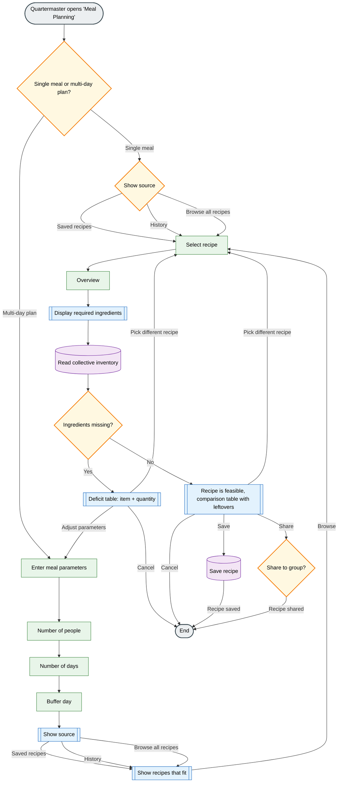

# Artifact 2 - Deciding

---

## Recipe-Based deficit calculation

This capability allows the Fellowship to select a meal or recipe and automatically compare the required ingredients with the group’s current inventory.  
The system calculates what ingredients are missing and how much of each item is still needed. This helps the group understand whether they can prepare a meal with their current supplies or if they need to gather or buy additional ingredients.  

We chose this capability because resource and food planning is one of the most important tasks for a group traveling through dangerous environments. The Fellowship needs to know not only what food they currently have but also whether it is enough to prepare meals for the entire group.  
Without this system, the quartermaster would need to manually check every member’s inventory and estimate ingredient quantities, which is slow and prone to mistakes.

At this stage of the journey the Fellowship is traveling through areas where resupply opportunities are limited and uncertain. Because of this, planning meals and managing food supplies becomes critical.
This capability helps them plan their next resupply more efficiently, avoids unnecessary purchases and limits resource wasting.

---

## Mermaid Flowchart

The flowchart below describes how the *Recipe-Based Deficit Calculation* works from the Quartermaster/User's perspective.  
It covers the scope of the meal, the recipe and the required ingredients compared to the Fellowship's collective inventory.  
Branching paths show how the user handles missing ingredients, syncing with a shopping list, adjusting parameters or completely switching recipes before saving the plan and optionally sharing it with the group. 

---

## Wireframe Interface

Create one wireframe that represents this capability.

Low-fidelity is sufficient (boxes, labels, structure)

Drawn, exported from a tool, created with simple shapes

This wireframe answers: "What does the user see and interact with?"

---

## Design Rationale
Explain your design decisions:
How does this design support the intent and value defined in your Assignment 1?
What did you deliberately leave out?
What assumptions or constraints influenced your design?
Clarity over completeness. Structure over cleverness.
