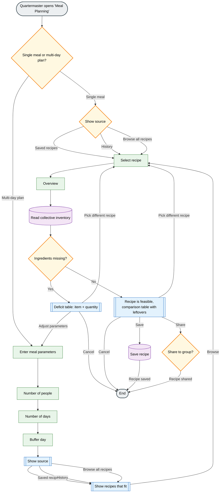

```mermaid
flowchart TB
    Start(["Quartermaster opens 'Meal Planning'"]) --> Q{Single meal or multi-day plan?}
    Q -->|Single meal| C{Show source}
    C -->|Saved recipes| H[Select recipe]
    C -->|History| H
    C -->|Browse all recipes| H
    Q -->|Multi-day plan| B[Enter meal parameters]
    B --> D[Number of people]
    D --> E[Number of days]
    E --> F[Buffer day]
    F --> G1[[Show source]]
    G1 -->|Saved recipes| G2[[Show recipes that fit]]
    G1 -->|History| G2
    G1 -->|Browse all recipes| G2
    G2 -->|Browse| H
    H --> T[Overview]
    T --> Z[(Read collective inventory)]
    Z --> I{Ingredients missing?}
    I -->|Yes| L[[Deficit table: item + quantity]]
    I -->|No| M[[Recipe is feasible, comparison table with leftovers]]
    L -->|Adjust parameters| B
    L -->|Pick different recipe| H
    L -->|Cancel| ZZ([End])
    M -->|Save| N[(Save recipe)]
    M -->|Share| S{Share to group?}
    M -->|Pick different recipe| H
    M -->|Cancel| ZZ
    N -->|Recipe saved| ZZ
    S -->|Recipe shared| ZZ

    Start:::endpoint
    Q:::decision
    C:::decision
    I:::decision
    S:::decision
    B:::user
    D:::user
    E:::user
    F:::user
    H:::user
    T:::user
    G1:::system
    G2:::system
    L:::system
    M:::system
    Z:::data
    N:::data
    ZZ:::endpoint
    classDef decision fill:#fff8e1,stroke:#f57c00,stroke-width:2px,color:#000
    classDef system fill:#e3f2fd,stroke:#1565c0,color:#000
    classDef data fill:#f3e5f5,stroke:#6a1b9a,color:#000
    classDef user fill:#e8f5e9,stroke:#2e7d32,color:#000
    classDef endpoint fill:#eceff1,stroke:#37474f,stroke-width:2px,color:#000
```
