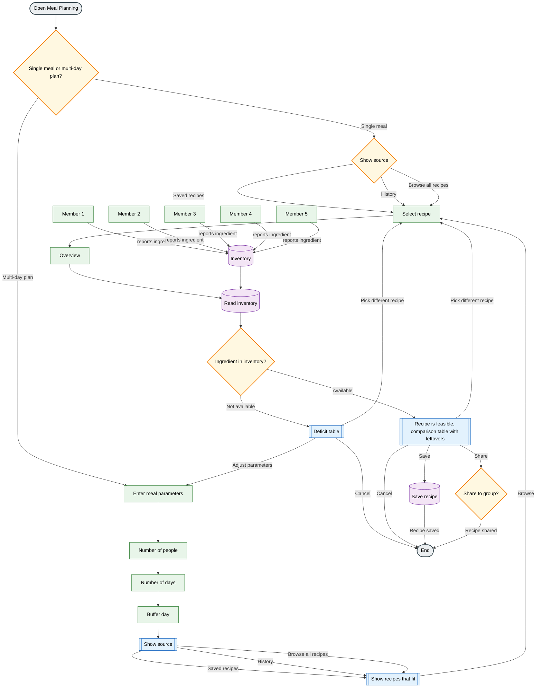
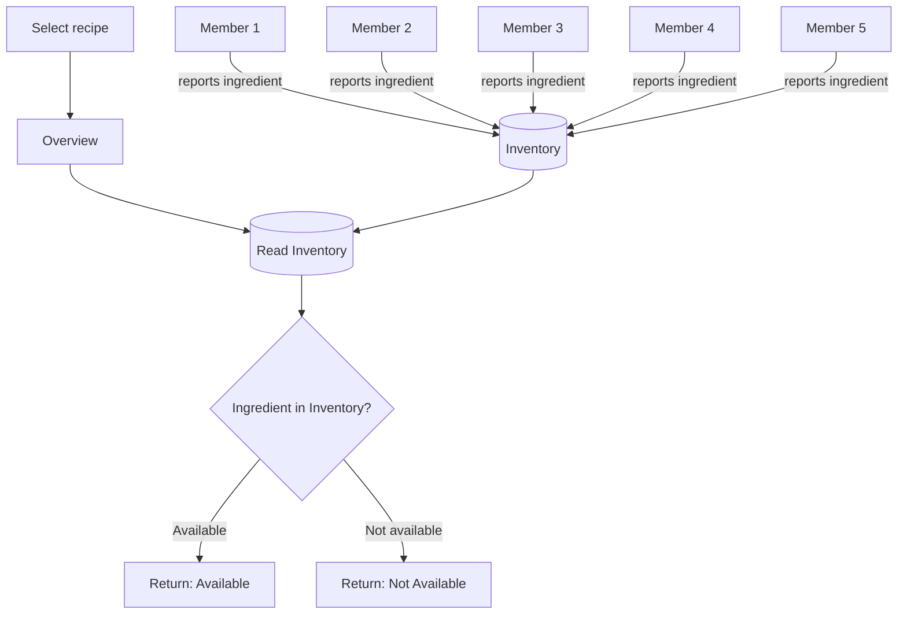

# Mermaid Flowchart

```mermaid
flowchart TB
    Start(["Open Meal Planning"]) --> Q{"Single meal or multi-day plan?"}
    Q -- Single meal --> C{"Show source"}
    C -- Saved recipes --> H["Select recipe"]
    C -- History --> H
    C -- Browse all recipes --> H
    Q -- "Multi-day plan" --> B["Enter meal parameters"]
    B --> D["Number of people"]
    D --> E["Number of days"]
    E --> F["Buffer day"]
    F --> G1[["Show source"]]
    G1 -- Saved recipes --> G2[["Show recipes that fit"]]
    G1 -- History --> G2
    G1 -- Browse all recipes --> G2
    G2 -- Browse --> H
    H --> T["Overview"]
    T --> Z[("Read inventory")]
    M1["Member 1"] -- reports ingredient --> INV[("Inventory")]
    M2["Member 2"] -- reports ingredient --> INV
    M3["Member 3"] -- reports ingredient --> INV
    M4["Member 4"] -- reports ingredient --> INV
    INV --> Z
    Z --> GATE{"Ingredient in inventory?"}
    GATE -- Available --> M[["Recipe is feasible, comparison table with leftovers"]]
    GATE -- Not available --> L[["Deficit table"]]
    L -- Adjust parameters --> B
    L -- Pick different recipe --> H
    L -- Cancel --> ZZ(["End"])
    M -- Save --> N[("Save recipe")]
    M -- Share --> S{"Share to group?"}
    M -- Pick different recipe --> H
    M -- Cancel --> ZZ
    N -- Recipe saved --> ZZ
    S -- Recipe shared --> ZZ
    M5["Member 5"] -- reports ingredient --> INV

     Start:::endpoint
     Q:::decision
     C:::decision
     H:::user
     B:::user
     D:::user
     E:::user
     F:::user
     G1:::system
     G2:::system
     T:::user
     Z:::data
     M1:::user
     INV:::data
     M2:::user
     M3:::user
     M4:::user
     GATE:::decision
     M:::system
     L:::system
     ZZ:::endpoint
     N:::data
     S:::decision
     M5:::user
    classDef decision fill:#fff8e1,stroke:#f57c00,stroke-width:2px,color:#000
    classDef system fill:#e3f2fd,stroke:#1565c0,color:#000
    classDef data fill:#f3e5f5,stroke:#6a1b9a,color:#000
    classDef user fill:#e8f5e9,stroke:#2e7d32,color:#000
    classDef endpoint fill:#eceff1,stroke:#37474f,stroke-width:2px,color:#000
```

## Inventory Teil 

```mermaid
flowchart TB
    M1["Member 1"] -- reports ingredient --> INV[("Inventory")]
    M2["Member 2"] -- reports ingredient --> INV
    M3["Member 3"] -- reports ingredient --> INV
    M4["Member 4"] -- reports ingredient --> INV
    M5["Member 5"] -- reports ingredient --> INV
    Q["Overview"] --> H
    G{"Ingredient in Inventory?"}
    INV --> H[("Read Inventory")]
    H --> G
    G -- Available --> Y["Return: Available"]
    G -- Not available --> N["Return: Not Available"]
    I["Select recipe"] --> Q
```
